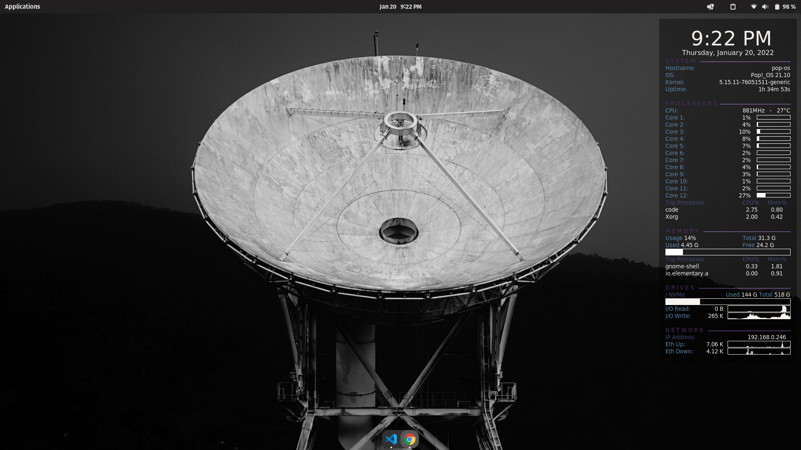

# My custom conky setup
This is based on MarkMcCoskey's design, but tweaked with a custom color palette.

Following screenshot was taken on pop-os with one of their default wallpapers.

## Usage
1. Install conky: `sudo apt install conky-all`
2. Clone this repo `git clone https://github.com/freddo256/ZorinConky.git`
3. Copy the config file to your home directory `cp ZorinConky/conky.config ~/.conkyrc`
4. Run conky trough your terminal `conky`

## Notes
Also check the LinuxMint branch out as the alignments are a little different.